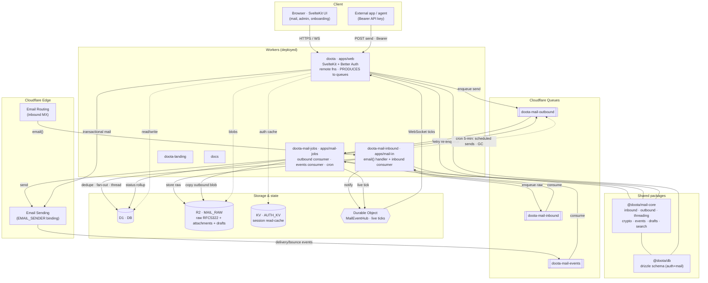
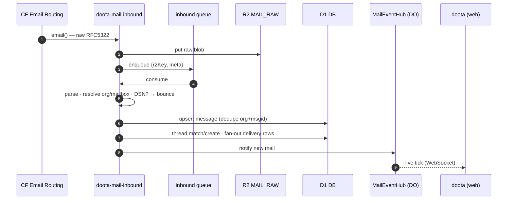
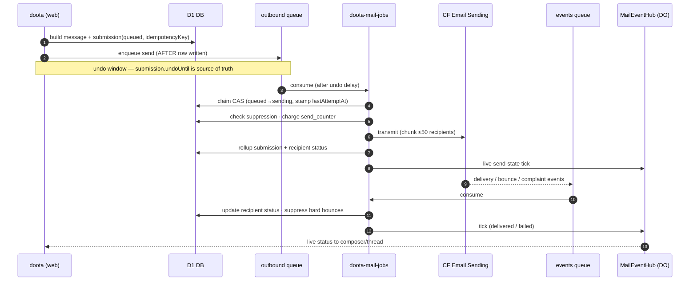

<div align="center">

# Doota

**Your email, finally yours.**

An email app you run yourself — where every conversation reads like a chat, on
your own address, on infrastructure only you control.

`Coming soon · building in the open`

</div>

---

## What is Doota?

Doota (say _DOO-tah_ — it means **messenger**) is a self-hosted email app that
runs entirely on your own [Cloudflare](https://cloudflare.com) account. No mail
server to babysit, no company sitting in the middle of your inbox. Mail arrives
through Cloudflare Email Routing, gets threaded into a WhatsApp-style
conversation, and is stored encrypted — with the raw message always kept whole
as the source of truth.

It still speaks plain email underneath, so you can write to anyone on Gmail or
Outlook, and they can write back.

## Features

- **Threads, not folders** — every conversation is one simple timeline of
  messages, interoperable with any mail client.
- **Runs on your own account** — Cloudflare Workers, D1, R2, KV, and Queues do
  the work. One deployment, one operator.
- **Private by default** — subjects and bodies encrypted at rest; routing
  metadata stays queryable so threading works without decryption.
- **Undo & scheduled send** — a first-class submission object tracks every
  message (queued → sent → delivered → bounced), with delivery ticks and
  send-later.
- **Hide-my-email aliases** — generate throwaway addresses on your domain, map
  them to a mailbox, disable them anytime.
- **Passwords or passkeys** — WebAuthn sign-in out of the box.
- **Open source, end to end** — read it, run it, change it. No subscriptions,
  no per-seat pricing, no lock-in.

## Tech stack

| Layer    | Choice                                                                    |
| -------- | ------------------------------------------------------------------------- |
| Frontend | [SvelteKit](https://svelte.dev) + [Tailwind CSS](https://tailwindcss.com) |
| Runtime  | Cloudflare Workers (`@sveltejs/adapter-cloudflare`)                        |
| Storage  | D1 (SQLite) · R2 (raw messages) · KV (cache) · Queues (mail-out)           |
| Mail     | Cloudflare Email Routing (inbound) + provider seam (outbound)             |
| Auth     | [better-auth](https://better-auth.com) with passkeys                      |
| Data     | [Drizzle ORM](https://orm.drizzle.team) + drizzle-kit migrations          |

## Architecture

Diagrams below are generated from the code — the D1 schemas in
`packages/db/src/*.schema.ts` and each worker's `wrangler.jsonc`. The full set
(binding matrix + `@doota/mail-core` module map) lives in
[`docs/architecture-diagrams.md`](docs/architecture-diagrams.md).

### Component & deployment — services, bindings, pipeline

Five deployed Workers, two shared packages, one D1 / R2 / KV / Durable-Object
backbone. A queue binds to exactly **one** consumer Worker, so the app only
_produces_; the async handlers live in the two mail Workers.



| Worker | D1 `DB` | R2 `MAIL_RAW` | KV `AUTH_KV` | DO `MAIL_EVENTS` | `EMAIL_SENDER` | Queues |
| --- | :-: | :-: | :-: | :-: | :-: | --- |
| **doota** (web) | ✓ | ✓ | ✓ | ✓ | ✓ | produces `inbound`, `outbound` |
| **doota-mail-inbound** | ✓ | ✓ | — | ✓ | — | produces+consumes `inbound` |
| **doota-mail-jobs** | ✓ | ✓ | — | ✓ | ✓ | consumes `outbound`+`events`, produces `outbound`; cron |
| **doota-landing** | — | — | — | — | — | — |
| **docs** | — | — | — | — | — | — |

### ER diagram — data model (Cloudflare D1)

Two namespaces share one D1 database: **auth.\*** (Better Auth) and **mail.\***
(app owned). The load-bearing split — `message` is one immutable row per unique
email, `delivery` is the per-mailbox receipt, `thread_state` is per-mailbox
triage, `submission` is send state. Content columns (`*_enc`) are encrypted;
routing + threading metadata stays cleartext.

```mermaid
erDiagram
    user {
        text id PK
        text email UK
        text role "member|admin|superadmin"
        bool twoFactorEnabled
        int  onboardedAt
        text invitedByUserId FK "→ user"
    }
    session {
        text id PK
        text userId FK
        text activeOrganizationId
    }
    account {
        text id PK
        text userId FK
        text providerId
    }
    organization {
        text id PK
        text slug UK
        text domain UK
        text zoneId
        text status
    }
    member {
        text id PK
        text organizationId FK
        text userId FK
        text role
    }
    invitation {
        text id PK
        text organizationId FK
        text inviterId FK
        text email
    }
    twoFactor {
        text id PK
        text userId FK
    }
    passkey {
        text id PK
        text userId FK
    }

    orgMailSettings {
        text orgId PK
        bool subaddressingEnabled
        text returnPathDomain
    }
    mailbox {
        text id PK
        text orgId FK
        text address "org+address UK"
        bool isPersonal
        bool isService
    }
    mailboxAccess {
        text id PK
        text userId FK
        text mailboxId FK
        bool canSend
    }
    alias {
        text id PK
        text orgId FK
        text mailboxId FK
        text address
    }
    thread {
        text id PK
        text orgId FK
        int  lastMessageAt
    }
    message {
        text id PK
        text orgId FK
        text threadId FK
        text messageIdHeader "org+msgid UK"
        text fromAddr
        text r2RawKey
        text bodyFullEnc
        text bodyHtmlEnc
    }
    delivery {
        text id PK
        text orgId FK
        text messageId FK
        text mailboxId FK
        text viaAliasId FK
        text role "to|cc|bcc|from"
        bool isRead
    }
    threadState {
        text id PK
        text threadId FK
        text mailboxId FK
        text assigneeUserId FK
        text placement "inbox|archived|spam|trash|sent"
        bool isStarred
    }
    threadRead {
        text id PK
        text userId FK
        text threadId FK
        text mailboxId FK
    }
    label {
        text id PK
        text orgId FK
        text name
    }
    threadLabel {
        text id PK
        text threadId FK
        text mailboxId FK
        text labelId FK
    }
    attachment {
        text id PK
        text messageId FK
        text r2Key
    }
    internalNote {
        text id PK
        text threadId FK
        text mailboxId FK
        text authorUserId FK
    }
    systemEvent {
        text id PK
        text threadId FK
        text mailboxId FK
        text actorUserId FK
    }
    draft {
        text id PK
        text orgId FK
        text mailboxId FK
        text createdByUserId FK
        text threadId FK
        text fromAliasId FK
        text kind "new|reply|reply_all|forward"
        text status "editing|sending|sent"
        text submissionId
    }
    submission {
        text id PK
        text orgId FK
        text messageId FK
        text mailboxId FK
        text fromAliasId FK
        text createdByUserId FK
        text idempotencyKey UK
        text status "queued|sending|…|delivered|bounced"
        int  undoUntil
    }
    submissionRecipient {
        text id PK
        text submissionId FK
        text address
        text role
        text status
    }
    suppression {
        text id PK
        text orgId FK
        text address
        text reason
    }
    sendCounter {
        text id PK
        text scope
        text scopeKey
    }
    apiKey {
        text id PK
        text orgId FK
        text userId FK
        text mailboxId FK
        text keyHash UK
    }

    user ||--o{ session : has
    user ||--o{ account : has
    user ||--o{ member : "belongs via"
    user ||--o{ twoFactor : has
    user ||--o{ passkey : has
    user ||--o{ invitation : sends
    user |o--o{ user : invited
    organization ||--o{ member : has
    organization ||--o{ invitation : has

    organization ||--|| orgMailSettings : configures
    organization ||--o{ mailbox : owns
    organization ||--o{ alias : owns
    organization ||--o{ thread : owns
    organization ||--o{ message : owns
    organization ||--o{ label : owns
    organization ||--o{ suppression : owns
    organization ||--o{ apiKey : owns

    mailbox ||--o{ mailboxAccess : "granted to users"
    user    ||--o{ mailboxAccess : granted
    mailbox ||--o{ alias : "forwards from"
    mailbox ||--o{ delivery : receives
    mailbox ||--o{ threadState : triages
    mailbox ||--o{ draft : "composed in"
    mailbox ||--o{ submission : "sends from"
    mailbox ||--o{ apiKey : "sends as"

    thread  ||--o{ message : contains
    thread  ||--o{ threadState : "per mailbox"
    thread  ||--o{ threadRead : "read cursors"
    thread  ||--o{ threadLabel : tagged
    thread  ||--o{ internalNote : notes
    thread  ||--o{ systemEvent : events
    message ||--o{ delivery : "fans out to"
    message ||--o{ attachment : has
    alias   ||--o{ delivery : "received via"
    label   ||--o{ threadLabel : applied

    message ||--o{ submission : "sent as"
    submission ||--o{ submissionRecipient : "fans out to"
    user ||--o{ draft : owns
    user ||--o{ submission : sent
```



### Mail pipeline — sequence

Inbound (receive):



Outbound (send + undo + provider events):



## Getting started

Requires Node 22+, [pnpm](https://pnpm.io), and a Cloudflare account.

```sh
pnpm install
cp .env.example .env      # then fill in the values (see below)
pnpm db:migrate:local     # apply D1 migrations to the local database
pnpm dev                  # http://localhost:5173
```

Create the first admin (genesis) with the CLI:

```sh
pnpm reset-admin
```

### Environment

See `.env.example` for the full list. The essentials:

- `ORIGIN` — your app's URL (must match the dev port, or auth routes 404).
- `BETTER_AUTH_SECRET` — 32+ chars, high entropy.
- `APP_CLOUDFLARE_ACCOUNT_ID` / `APP_CLOUDFLARE_API_TOKEN` — a **scoped** API
  token (not the Global API Key), stored as a Worker secret in production.
- `MAIL_IN_WORKER_NAME` — the deployed mail-in Worker the catch-all rule targets.
- `LOG_LEVEL` — optional mail-pipeline log level (`debug`/`info`/`warn`/`error`,
  default `info`); set per Worker (web, mail-in, mail-jobs) as a plain var.

### Deploy

```sh
pnpm db:migrate:remote    # migrate the production D1 database
pnpm deploy               # build + wrangler deploy
```

## Repository layout

- `src/` — the Doota app (SvelteKit + Workers).
- `drizzle/` — database migrations.
- `landing/` — the standalone marketing site (its own SvelteKit project; `pnpm --dir landing dev`).

## Useful scripts

| Script             | Does                                      |
| ------------------ | ----------------------------------------- |
| `pnpm check`       | auth-boundary check + `svelte-check`      |
| `pnpm test`        | run the Vitest suite                      |
| `pnpm db:studio`   | open Drizzle Studio                       |
| `pnpm auth:schema` | regenerate the better-auth Drizzle schema |
| `pnpm gen`         | regenerate Cloudflare binding types       |

## Status

Doota is under development and moving fast. Star the repo to follow along until launch.

## License & credits

An independent open-source project by **[Ethercorps](https://github.com/ethercorps)**.

Not affiliated with, endorsed by, or sponsored by Cloudflare. Cloudflare,
Workers, R2, and D1 are trademarks of Cloudflare, Inc.

© 2026 Ethercorps
