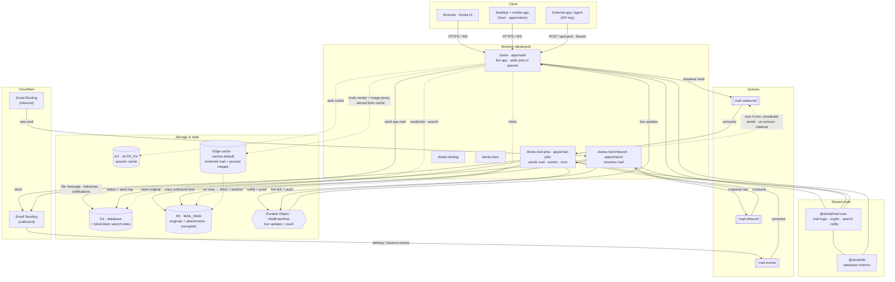
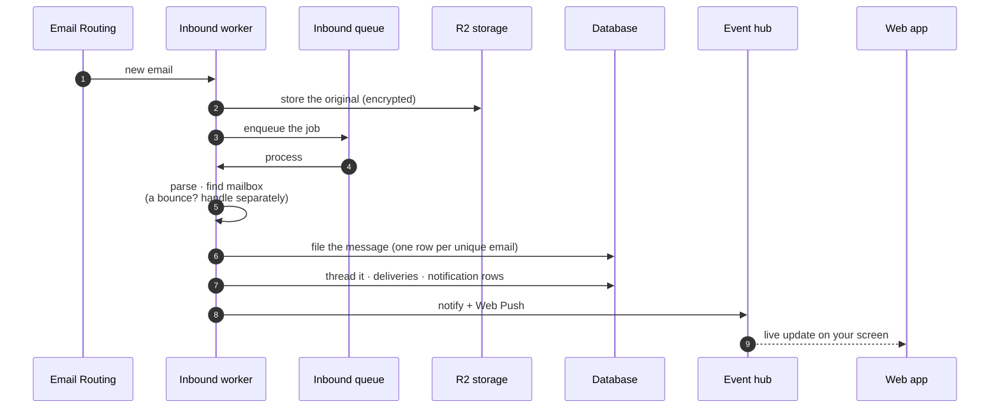
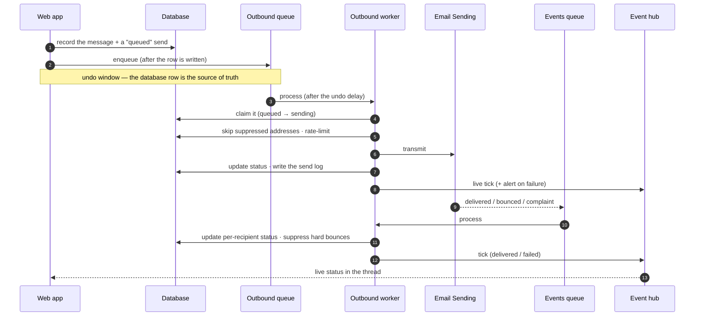
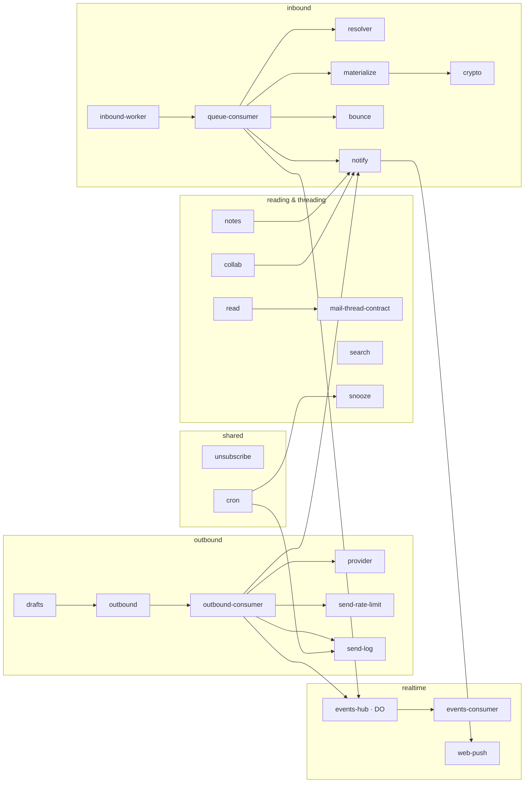

Doota is one app that runs entirely on **your own Cloudflare account**. This page
starts with a picture anyone can follow, then goes deeper for engineers.

If you just want the gist: mail arrives at Cloudflare, three small programs
("Workers") receive it, store it safely, and show it to you as a chat — and the
reverse when you send. The diagrams below are all [Mermaid](https://mermaid.js.org)
and render to SVG in your browser (click the ⤢ on any diagram to enlarge).

---

## System at a glance

The whole system, with logos for the pieces Cloudflare provides and the Doota app
itself. Everything inside the **Cloudflare** box runs on your account — there is no
Doota server in the middle.

```mermaid
architecture-beta
    group cloud(logos:cloudflare-icon)[Cloudflare]

    service you(ph:user)[You]
    service routing(ph:envelope)[Routing] in cloud
    service inbox(logos:cloudflare-workers-icon)[Inbound] in cloud
    service r2(ph:hard-drives)[R2] in cloud
    service web(doota:mail)[Doota] in cloud
    service jobs(logos:cloudflare-workers-icon)[Outbound] in cloud
    service sending(ph:paper-plane-tilt)[Sending] in cloud
    service cache(ph:lightning)[Cache] in cloud
    service db(ph:database)[D1] in cloud
    service hub(ph:broadcast)[Live] in cloud

    you:R --> L:routing
    routing:R --> L:inbox
    inbox:R --> L:r2
    r2:R --> L:web
    web:R --> L:jobs
    jobs:R --> L:sending
    web:T --> B:cache
    web:B --> T:db
    jobs:T --> B:hub
```

**In plain terms:**

- **You** open the Doota web app (or the desktop/mobile app, which wraps the same
  web app) in your browser.
- **Email routing** is Cloudflare's inbound mail; it hands each new message to the
  **inbound worker**, which files the original safely in **R2 storage**.
- The **Doota web app** reads and writes the **D1 database** (the index of your
  mail) and, when you send, hands the job to the **outbound worker**, which posts
  it through **email sending**.
- The **edge cache** keeps rendered messages and proxied images close by, so
  re-opening a message is instant — and images in an email load *through* Doota,
  so the sender never sees you.
- The **realtime hub** pushes live updates (a message arrived, a send delivered)
  back to your screen without refreshing.

**A few terms, once:** a **Worker** is a small program that runs on Cloudflare's
edge; **D1** is Cloudflare's SQL database; **R2** is its file storage. You don't
manage servers — Cloudflare runs all of this for you.

---

## 1. Data model (the D1 database)

Two groups of tables share one database:

- **auth.\*** — sign-in and identity (people, sessions, organisation, two-factor,
  passkeys), managed by the Better Auth library.
- **mail.\*** — the app's own tables (mailboxes, messages, threads, templates,
  send log…).

The load-bearing idea: `message` is **one row per unique email** (the same email to
five people is one row); `delivery` records who received it; `thread_state` is each
mailbox's own triage (inbox / snoozed / archived…); `submission` tracks a send.
Anything ending `_enc` (and the log's `dataCipher`) is **encrypted**; routing and
threading fields stay readable so the app is fast.

```mermaid
erDiagram
    user {
        text id PK
        text email UK
        text role "member|admin|superadmin"
        bool twoFactorEnabled
        text recoveryEmail
        bool mustChangePassword
        int  onboardedAt
        bool banned
    }
    session {
        text id PK
        text userId FK
        text activeOrganizationId
        int  expiresAt
    }
    account {
        text id PK
        text userId FK
        text password
    }
    organization {
        text id PK
        text slug UK
        text domain UK
        text zoneId
        text status "pending_zone|…|active"
    }
    member {
        text id PK
        text organizationId FK
        text userId FK
        text role
    }
    twoFactor {
        text id PK
        text userId FK
        text secret
    }
    passkey {
        text id PK
        text userId FK
        text credentialID
    }

    orgMailSettings {
        text orgId PK "FK → organization"
        bool subaddressingEnabled
        text remoteContentMode "block|allow"
        bool remoteContentLocked
    }
    mailbox {
        text id PK
        text orgId FK
        text address "org+address UK"
        bool isPersonal
        bool isService
    }
    mailboxAccess {
        text id PK
        text userId FK
        text mailboxId FK
        bool canManage
        bool canSend
        bool assignedOnly
    }
    mailboxSignature {
        text id PK
        text userId FK
        text mailboxId FK
        text bodyHtml
    }
    alias {
        text id PK
        text orgId FK
        text mailboxId FK
        text address "hide-my-email"
    }
    thread {
        text id PK
        text orgId FK
        text subjectNormalized
        int  lastMessageAt
    }
    message {
        text id PK
        text orgId FK
        text threadId FK
        text messageIdHeader "org+msgid UK"
        text fromAddr
        text r2RawKey "→ R2 raw (HTML derived on render)"
        text subjectEnc
        text bodyStrippedEnc
        text bodyFullEnc
        text itemType "external_message|note|event"
    }
    delivery {
        text id PK
        text messageId FK
        text mailboxId FK
        text viaAliasId FK
        text role "to|cc|bcc|from"
        bool isRead
    }
    threadState {
        text id PK
        text threadId FK
        text mailboxId FK
        text assigneeUserId FK
        text placement "inbox|archived|spam|trash|sent"
        bool isStarred
        int  snoozedUntil
        int  hiddenAt
    }
    threadRead {
        text id PK
        text userId FK
        text threadId FK
        int  lastReadAt
    }
    label {
        text id PK
        text orgId FK
        text name
    }
    threadLabel {
        text id PK
        text threadId FK
        text labelId FK
    }
    attachment {
        text id PK
        text messageId FK
        text r2Key "→ R2 blob"
        bool inline
    }
    calendarEvent {
        text id PK
        text messageId FK "UK"
        text uid
        text method "REQUEST|REPLY|CANCEL"
        text status
    }
    calendarRsvp {
        text id PK
        text userId FK
        text uid
        text status
    }
    internalNote {
        text id PK
        text threadId FK
        text authorUserId FK
        text bodyEnc
        int  deletedAt
    }
    draft {
        text id PK
        text mailboxId FK
        text createdByUserId FK
        text threadId FK
        text kind "new|reply|reply_all|forward"
        text status "editing|sending|sent"
    }
    submission {
        text id PK
        text messageId FK
        text mailboxId FK
        text apiKeyId FK "→ apiKey (nullable)"
        text createdByUserId FK
        text idempotencyKey UK
        text status "queued|sending|sent|delivered|bounced…"
        int  sendAt
        int  undoUntil
    }
    submissionRecipient {
        text id PK
        text submissionId FK
        text address "sub+addr UK"
        text status
        text bounceType
    }
    suppression {
        text id PK
        text orgId FK
        text address "hard bounce|complaint"
    }
    apiKey {
        text id PK
        text orgId FK
        text mailboxId FK "service send scope"
        text name
        text keyHash UK
        bool isService
        int  revokedAt
    }
    sendEvent {
        text id PK
        text orgId FK
        text mailboxId FK
        text apiKeyId FK
        text submissionId FK
        text templateId
        int  templateVersion
        text subject
        blob dataCipher "encrypted, TTL"
        int  dataExpiresAt
    }
    template {
        text id PK
        text orgId FK
        text slug "org+slug UK"
        text currentVersionId
        int  archivedAt
    }
    templateVersion {
        text id PK
        text templateId FK
        int  version "tmpl+version UK"
        text subjectTemplate
        text compiledHtml
        text editorJson "JSON"
    }
    notification {
        text id PK
        text userId FK
        text orgId FK
        text type "new_mail|send_failed|assigned|note|mention"
        text threadId
        text actorUserId FK
        int  readAt
        int  seenAt
    }
    pushSubscription {
        text id PK
        text userId FK
        text endpoint UK
        text p256dh
        text auth
    }
    correspondent {
        text id PK
        text mailboxId FK
        text address "mbx+addr UK"
        int  lastSeenAt
    }

    user ||--o{ session : has
    user ||--o{ account : has
    user ||--o{ member : "belongs via"
    user ||--o{ twoFactor : has
    user ||--o{ passkey : has
    user ||--o{ notification : receives
    user ||--o{ pushSubscription : subscribes
    user ||--o{ mailboxSignature : "signs with"
    organization ||--o{ member : has

    organization ||--|| orgMailSettings : configures
    organization ||--o{ mailbox : owns
    organization ||--o{ alias : owns
    organization ||--o{ thread : owns
    organization ||--o{ message : owns
    organization ||--o{ label : owns
    organization ||--o{ suppression : owns
    organization ||--o{ apiKey : owns
    organization ||--o{ template : owns
    organization ||--o{ sendEvent : logs

    mailbox ||--o{ mailboxAccess : "granted to users"
    user    ||--o{ mailboxAccess : granted
    mailbox ||--o{ alias : "forwards from"
    mailbox ||--o{ delivery : receives
    mailbox ||--o{ threadState : triages
    mailbox ||--o{ draft : "composed in"
    mailbox ||--o{ submission : "sends from"
    mailbox ||--o{ apiKey : "sends as"
    mailbox ||--o{ correspondent : "recent people"

    thread  ||--o{ message : contains
    thread  ||--o{ threadState : "has per mailbox"
    thread  ||--o{ threadRead : "read cursors"
    thread  ||--o{ threadLabel : tagged
    thread  ||--o{ internalNote : notes
    message ||--o{ delivery : "fans out to"
    message ||--o{ attachment : has
    message ||--o| calendarEvent : "iMIP"
    label   ||--o{ threadLabel : applied

    message ||--o{ submission : "sent as"
    submission ||--o{ submissionRecipient : "fans out to"
    apiKey ||--o{ submission : originated
    apiKey ||--o{ sendEvent : "logged from"
    template ||--o{ templateVersion : versions
    submission ||--o| sendEvent : "audited by"
```

---

## 2. Component & deployment — what runs where

Five deployed Workers (plus the Tauri desktop/mobile app, which is a client, not a
Worker), two core shared code packages, and one storage backbone (D1 · R2 · KV · an
edge cache · a Durable Object). A queue feeds exactly **one** Worker, so the web app
only *adds* jobs; the background work happens in the two mail Workers.

### Which Worker holds which binding

| Worker | D1 | R2 | KV | Event hub | Email sending | Queues | Cron |
| --- | :-: | :-: | :-: | :-: | :-: | --- | :-: |
| **doota** (web) | ✓ | ✓ | ✓ | ✓ | ✓ | adds to `inbound`, `outbound` | — |
| **doota-mail-inbound** | ✓ | ✓ | ✓ | ✓ | — | receives `inbound` | — |
| **doota-mail-jobs** | ✓ | ✓ | — | ✓ (owner) | ✓ | receives `outbound` + `events` | `*/5` |
| **doota-landing** | — | — | — | — | — | — | — |
| **doota-docs** | — | — | — | — | — | — | — |

The event hub (`MailEventHub`) is **defined in `doota-mail-jobs`** and shared with
the other two, so deploy order is **`doota-mail-jobs` → `doota-mail-inbound` →
`doota` (web)**.

---

## 3. Mail pipeline — step by step

### Receiving

### Sending (with undo + delivery events)

---

## 4. `@doota/mail-core` — the shared logic

The mail logic used by the web app **and** both mail Workers (framework-free).

---

_Keep these current after schema or binding changes: the data model tracks
`packages/db/src/{auth,mail}.schema.ts`; the component view tracks each Worker's
`wrangler.jsonc`. A deeper, engineering-focused version of these diagrams lives in
the repo at `docs/architecture-diagrams.md`._
