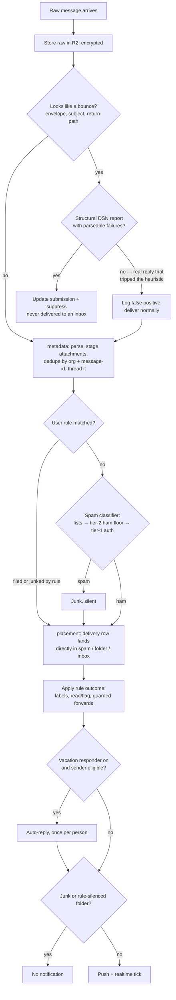
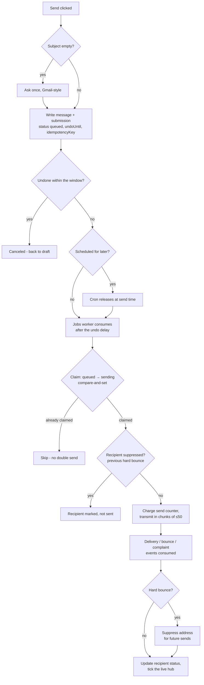
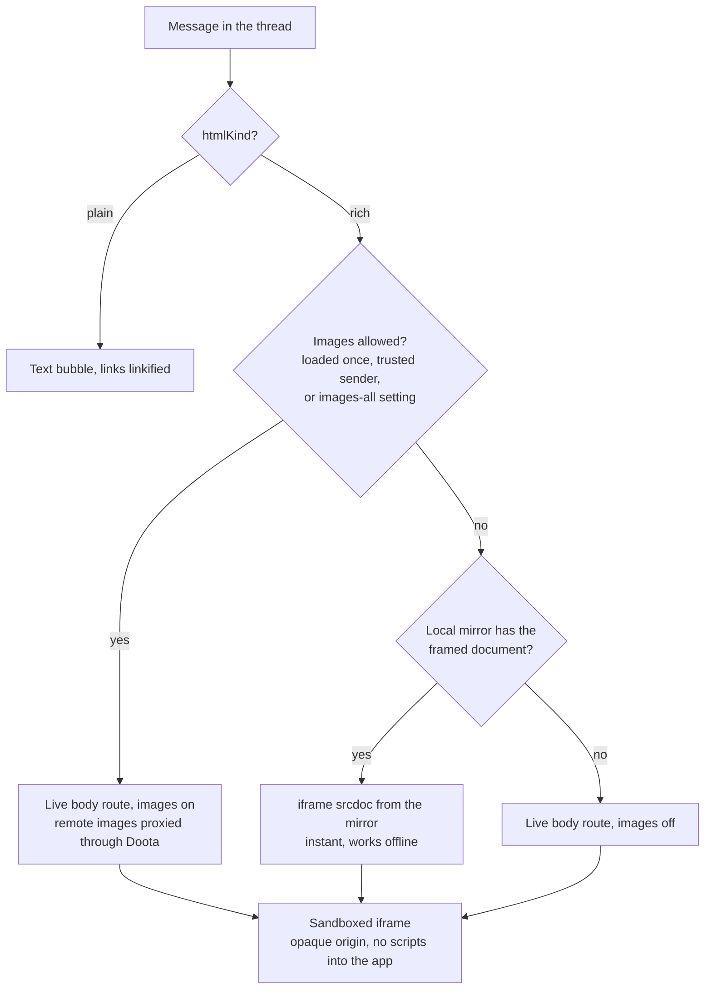
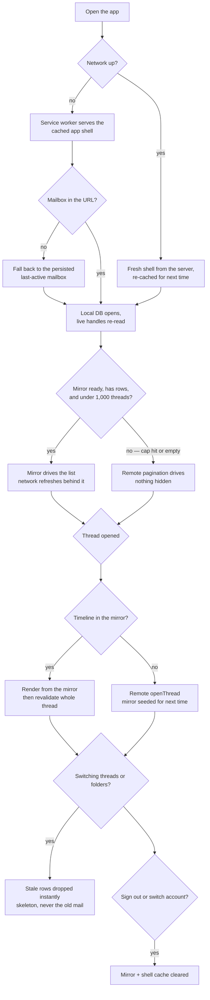
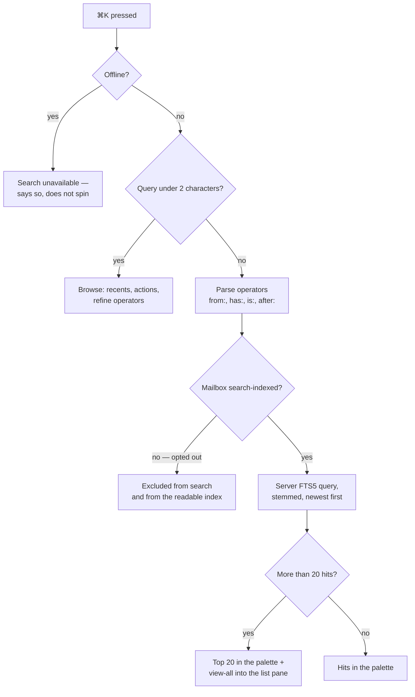
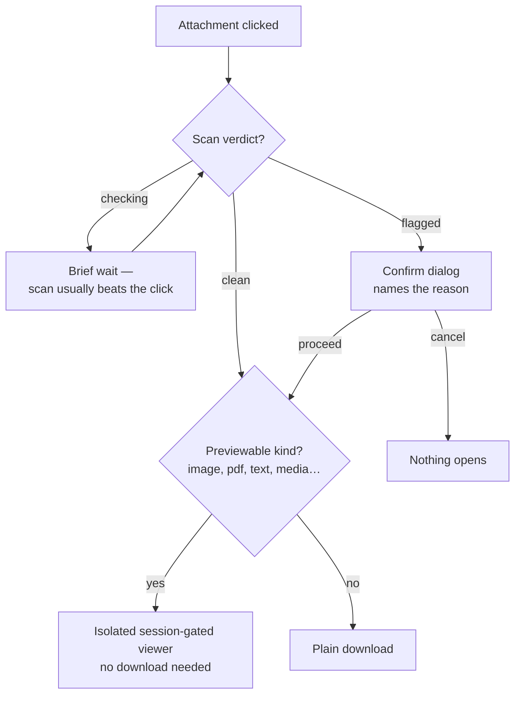
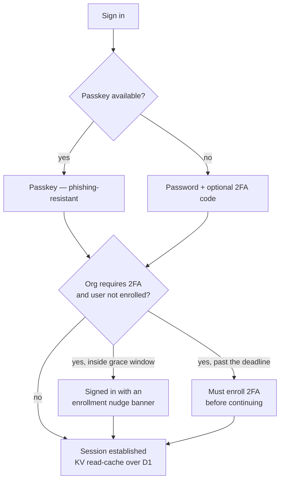

The [architecture diagrams](/reference/architecture-diagrams) show what runs
where. This page shows **what the code decides** — the branch points in each
feature, as flowcharts. Every diamond below is a real decision in the codebase,
in the order it runs.

## 1. Inbound mail — receive, classify, file

The inbound consumer runs one message through a fixed stage list:
**metadata → rulesEval → placement → vacation → notify**. Before the stages, a
bounce check keeps delivery reports out of inboxes — but only *structural* DSNs
are dropped, so a real reply that merely looks bounce-ish is delivered.

Two precedence decisions worth naming:

- **A user rule beats the classifier.** An explicit `moveTo` is a statement
  about that sender; the heuristic yields. A user junk rule needs no help.
- **Rule-matched mail never flashes through the Inbox** — the placement override
  applies at insert time, so a new thread lands filed or junked directly.

## 2. Outbound mail — send, undo, deliver

The web app writes the submission first, then enqueues; the undo window lives on
the submission row, and the jobs worker only claims work with a compare-and-set
so a retry can't double-send.

## 3. Rendering a message — text, HTML, images

Sender HTML never reaches the client raw: it is sanitized and framed
**server-side**, then shown in a sandboxed iframe with no same-origin access.
The only decisions client-side are *which* framed document to load and whether
images are allowed.

The trust decision feeding "images allowed": a **DMARC-passing** sender shows
the *Verified* chip; a sender you marked trusted loads images automatically
(and can be un-trusted from the same spot).

## 4. Local-first and offline

The client keeps a SQLite mirror (thread list + opened-thread timelines) and a
service-worker shell cache. Every render picks a source; the mirror wins when it
can, the network stays authoritative.

Offline is **read-only** by decision: compose and search are disabled with an
offline bar rather than queued silently — there is no offline outbox.

## 5. Search

Search is a server-side FTS5 index (porter stemming), which is also why it
declines politely offline instead of spinning.

The standing decision behind this: the index is **readable plaintext by design**
(the Fastmail posture) — full-text quality over at-rest purity, opt-out per
mailbox. Spelled out in [Security](/reference/security).

## 6. Opening an attachment — scan, then view

Attachments are scanned **on your device** against a versioned ruleset before
anything opens; a verdict from an older ruleset triggers a rescan.

## 7. Signing in

Two fixed decisions here: **admins cannot drop 2FA** while org enforcement is
on, and the browser-facing admin auth surface is blocked at the edge — admin
actions go through the app's own authorized routes.

## Reading these diagrams

Each flowchart compresses the real code path; the prose around it names the
deliberate trade-offs. When a diagram and the code disagree, the code wins —
and the diagram should be fixed in the same change.
