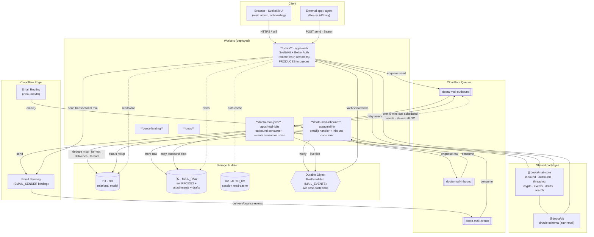
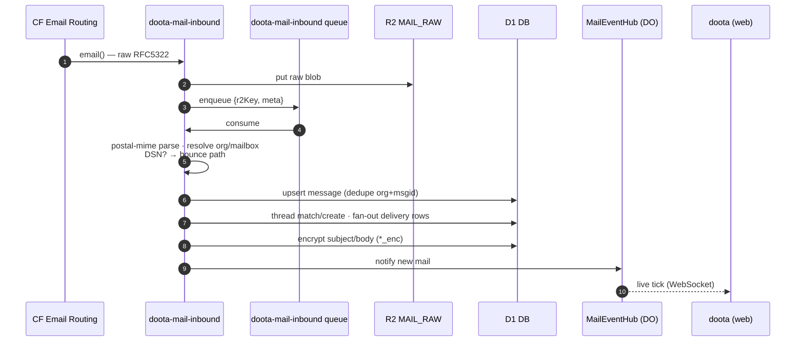
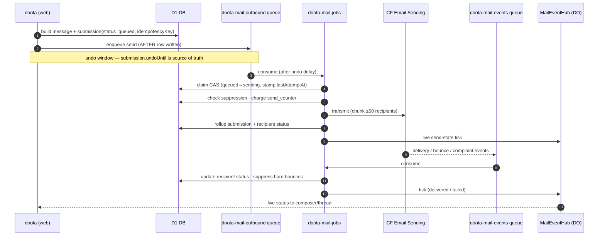
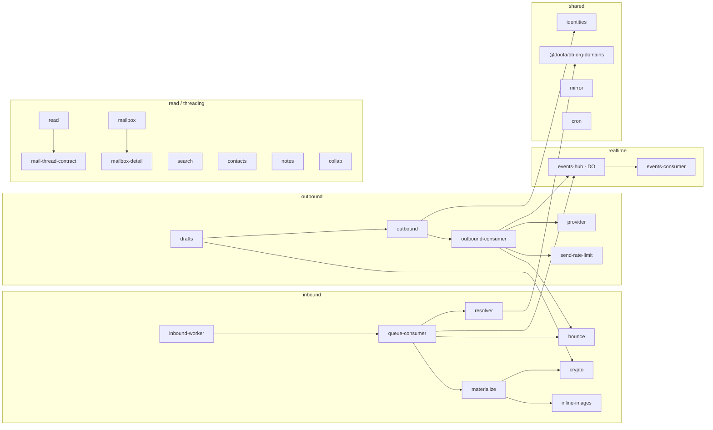

# Doota — Architecture & Data Model

Two views of the whole system, generated from the code (D1 schemas in
`packages/db/src/*.schema.ts` and the worker `wrangler.jsonc` bindings).

- **ER diagram** — the D1 relational model (auth + mail).
- **UML / component + deployment** — services, bindings, queues, the Durable
  Object hub, storage, and the mail pipeline flow.

All diagrams are [Mermaid](https://mermaid.js.org) — they render on GitHub and in
most Markdown viewers.

---

## 1. ER diagram — data model (Cloudflare D1)

Two namespaces share one D1 database:
- **auth.\*** — Better Auth owned (user, session, org, member, 2FA, passkey…).
- **mail.\*** — app owned (mailbox, message, delivery, thread, draft, submission…).

The load-bearing split: `message` is one immutable row per unique email;
`delivery` is the per-mailbox receipt; `thread_state` is per-mailbox triage;
`submission` is send state. Content columns (`*_enc`) are encrypted; routing +
threading metadata stays cleartext.

```mermaid
erDiagram
    %% ---------- AUTH namespace (Better Auth) ----------
    user {
        text id PK
        text email UK
        text role "member|admin|superadmin"
        bool twoFactorEnabled
        text recoveryEmail
        int  onboardedAt
        text invitedByUserId FK "→ user (invite chain)"
        bool banned
    }
    session {
        text id PK
        text userId FK
        text activeOrganizationId
        int  expiresAt
    }
    account {
        text id PK
        text userId FK
        text providerId
        text password
    }
    verification {
        text id PK
        text identifier
    }
    organization {
        text id PK
        text slug UK
        text domain UK
        text zoneId
        text status "pending_zone|…|active"
    }
    member {
        text id PK
        text organizationId FK
        text userId FK
        text role
    }
    invitation {
        text id PK
        text organizationId FK
        text inviterId FK "→ user"
        text email
        text status
    }
    twoFactor {
        text id PK
        text userId FK
        text secret
    }
    passkey {
        text id PK
        text userId FK
        text credentialID
    }
    rateLimit {
        text id PK
        text key UK
    }

    %% ---------- MAIL namespace (app owned) ----------
    orgMailSettings {
        text orgId PK "FK → organization"
        bool subaddressingEnabled
        text routingSubdomains "JSON hosts"
        text returnPathDomain
    }
    mailbox {
        text id PK
        text orgId FK
        text address "org+address UK"
        bool isPersonal
        bool isService
    }
    mailboxAccess {
        text id PK
        text userId FK
        text mailboxId FK
        bool canManage
        bool canSend
    }
    alias {
        text id PK
        text orgId FK
        text mailboxId FK
        text address "hide-my-email"
    }
    thread {
        text id PK
        text orgId FK
        text subjectNormalized
        int  lastMessageAt
    }
    message {
        text id PK
        text orgId FK
        text threadId FK
        text messageIdHeader "org+msgid UK"
        text fromAddr
        text toAddrs "JSON"
        text ccAddrs "JSON"
        text r2RawKey "→ R2 blob"
        text subjectEnc
        text bodyFullEnc
        text bodyHtmlEnc
        text itemType "external_message|note|event"
    }
    delivery {
        text id PK
        text orgId FK
        text messageId FK
        text mailboxId FK
        text viaAliasId FK "→ alias"
        text role "to|cc|bcc|from"
        bool isRead
        text keywords "JMAP flags"
    }
    threadState {
        text id PK
        text orgId FK
        text threadId FK
        text mailboxId FK
        text assigneeUserId FK "→ user"
        text placement "inbox|archived|spam|trash|sent"
        bool isStarred
        int  hiddenAt
    }
    threadRead {
        text id PK
        text userId FK
        text threadId FK
        text mailboxId FK
        int  lastReadAt "per-user cursor"
    }
    label {
        text id PK
        text orgId FK
        text name
    }
    threadLabel {
        text id PK
        text threadId FK
        text mailboxId FK
        text labelId FK
    }
    attachment {
        text id PK
        text messageId FK
        text r2Key "→ R2 blob"
        text filename
    }
    internalNote {
        text id PK
        text orgId FK
        text threadId FK
        text mailboxId FK
        text authorUserId FK "→ user"
        text bodyEnc
        int  deletedAt "soft delete"
    }
    systemEvent {
        text id PK
        text orgId FK
        text threadId FK
        text mailboxId FK
        text actorUserId FK "→ user"
        text eventType
    }
    draft {
        text id PK
        text orgId FK
        text mailboxId FK
        text createdByUserId FK "→ user"
        text threadId FK
        text fromAliasId FK "→ alias"
        text kind "new|reply|reply_all|forward"
        text status "editing|sending|sent"
        text submissionId "→ submission (tombstone)"
        int  clientRevision
    }
    submission {
        text id PK
        text orgId FK
        text messageId FK
        text mailboxId FK
        text fromAliasId FK "→ alias"
        text createdByUserId FK "→ user"
        text idempotencyKey UK
        text status "queued|sending|sent|delivered|bounced…"
        int  sendAt
        int  undoUntil
        int  lastAttemptAt
    }
    submissionRecipient {
        text id PK
        text submissionId FK
        text address "sub+addr UK"
        text role "to|cc|bcc"
        text status
        text bounceType
    }
    suppression {
        text id PK
        text orgId FK
        text address "hard bounce|complaint"
        text reason
    }
    sendCounter {
        text id PK
        text scope "mailbox|instance"
        text scopeKey
        int  windowStart
    }
    apiKey {
        text id PK
        text orgId FK
        text userId FK "acts-as user"
        text mailboxId FK "service scope"
        text keyHash UK
        bool isService
    }

    %% ---------- auth relationships ----------
    user ||--o{ session : has
    user ||--o{ account : has
    user ||--o{ member : "belongs via"
    user ||--o{ twoFactor : has
    user ||--o{ passkey : has
    user ||--o{ invitation : sends
    user |o--o{ user : invited
    organization ||--o{ member : has
    organization ||--o{ invitation : has

    %% ---------- org → mail ----------
    organization ||--|| orgMailSettings : configures
    organization ||--o{ mailbox : owns
    organization ||--o{ alias : owns
    organization ||--o{ thread : owns
    organization ||--o{ message : owns
    organization ||--o{ label : owns
    organization ||--o{ suppression : owns
    organization ||--o{ apiKey : owns

    %% ---------- mailbox graph ----------
    mailbox ||--o{ mailboxAccess : "granted to users"
    user    ||--o{ mailboxAccess : "granted"
    mailbox ||--o{ alias : "forwards from"
    mailbox ||--o{ delivery : receives
    mailbox ||--o{ threadState : triages
    mailbox ||--o{ draft : "composed in"
    mailbox ||--o{ submission : "sends from"
    mailbox ||--o{ apiKey : "sends as"

    %% ---------- thread / message graph ----------
    thread  ||--o{ message : contains
    thread  ||--o{ threadState : "has per mailbox"
    thread  ||--o{ threadRead : "read cursors"
    thread  ||--o{ threadLabel : tagged
    thread  ||--o{ internalNote : "notes"
    thread  ||--o{ systemEvent : "events"
    message ||--o{ delivery : "fans out to"
    message ||--o{ attachment : has
    alias   ||--o{ delivery : "received via"
    label   ||--o{ threadLabel : applied

    %% ---------- outbound graph ----------
    message ||--o{ submission : "sent as"
    submission ||--o{ submissionRecipient : "fans out to"
    user ||--o{ draft : owns
    user ||--o{ submission : sent
```

---

## 2. Component & deployment — services, bindings, pipeline

Five deployed Workers, two shared packages, one D1 / R2 / KV / Durable-Object
backbone. A queue binds to exactly **one** consumer Worker, so the app only
*produces*; the async handlers live in the two mail Workers.

### Binding matrix

| Worker | D1 `DB` | R2 `MAIL_RAW` | KV `AUTH_KV` | DO `MAIL_EVENTS` | `EMAIL_SENDER` | Queues |
| --- | :-: | :-: | :-: | :-: | :-: | --- |
| **doota** (web) | ✓ | ✓ | ✓ | ✓ | ✓ | produces `inbound`, `outbound` |
| **doota-mail-inbound** | ✓ | ✓ | — | ✓ | — | produces+consumes `inbound` |
| **doota-mail-jobs** | ✓ | ✓ | — | ✓ | ✓ | consumes `outbound`+`events`, produces `outbound`; cron |
| **doota-landing** | — | — | — | — | — | — |
| **docs** | — | — | — | — | — | — |

---

## 3. Mail pipeline — sequence

### Inbound (receive)

### Outbound (send + undo + events)

---

## 4. `@doota/mail-core` — module map

The domain logic shared by web + both mail Workers (no framework, drizzle only).

---

_Regenerate after schema/binding changes: the ER model tracks
`packages/db/src/{auth,mail}.schema.ts`; the component view tracks each worker's
`wrangler.jsonc`._
