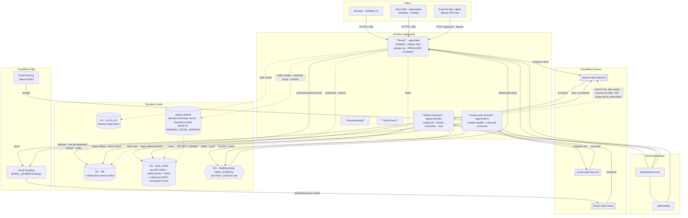
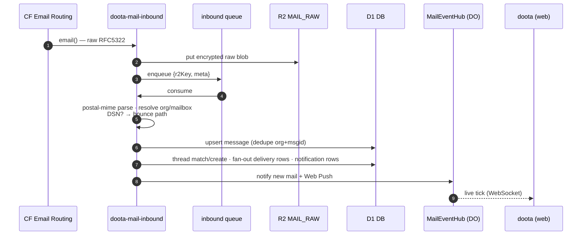
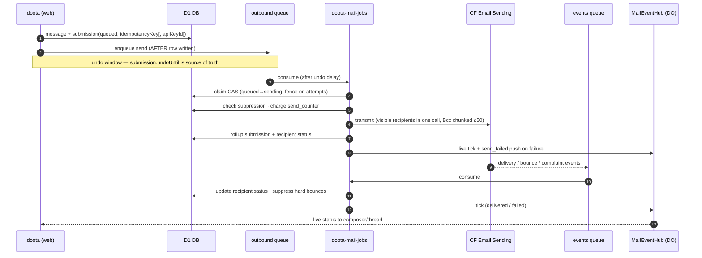
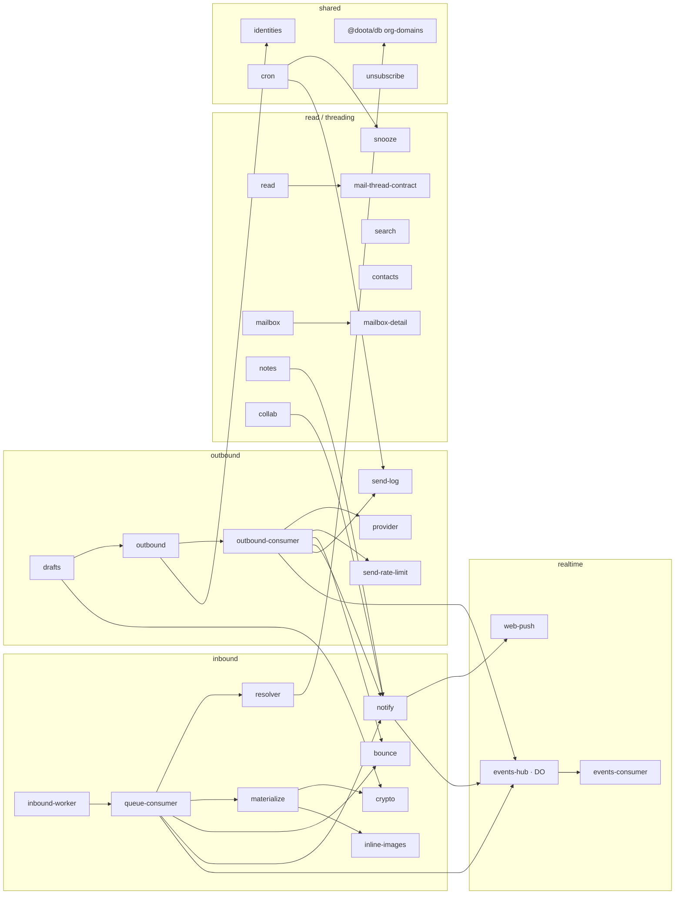

# Doota — Architecture & Data Model

Three views of the whole system, generated from the code (D1 schemas in
`packages/db/src/*.schema.ts`, worker `wrangler.jsonc` bindings, and the pnpm
workspace).

- **Monorepo map** — the workspaces and what deploys.
- **ER diagram** — the D1 relational model (auth + mail).
- **Component + deployment + sequence** — services, bindings, queues, the Durable
  Object hub, storage, and the mail pipeline flow.

Mermaid diagrams render on GitHub and in most Markdown viewers. Written 2026-08-02.

---

## 0. Monorepo map (pnpm workspace)

Root `package.json` globs `apps/*` + `packages/*` (see `pnpm-workspace.yaml`).
`@doota/*` are the internal package names; the deployable web app's package name
is the bare `doota`.

### Apps

| Dir | Package | Deploys as | Role |
| --- | --- | --- | --- |
| `apps/web` | `doota` | Worker `doota` (`mail.doota.dev`) | SvelteKit + Better Auth; remote functions (`*.remote.ts`); **produces** to mail queues. |
| `apps/mail-in` | `@doota/mail-in` | Worker `doota-mail-inbound` | `email()` handler + **consumes** `doota-mail-inbound`. Name is load-bearing — the Email Routing catch-all targets it. |
| `apps/mail-jobs` | `@doota/mail-jobs` | Worker `doota-mail-jobs` | **Consumes** `doota-mail-outbound` + `doota-mail-events`; owns the `MailEventHub` DO; cron `*/5`. |
| `apps/landing` | `doota-landing` | Worker `doota-landing` | Marketing site (adapter-static). |
| `apps/docs` | `docs` | Worker `doota-docs` | Astro/Starlight user + operator guide. |
| `apps/native` | `doota-mail` | client app (not a Worker) | **Tauri v2** desktop (macOS/Windows/Linux) + mobile (iOS/Android) shell — "Doota Mail" (`com.doota.mail`). Wraps the web UI; `src-tauri/` (Rust) + Vite frontend; `gen/android` + `gen/apple` are CLI-generated. Not part of the Cloudflare deploy. |

### Packages

| Dir | Package | Role |
| --- | --- | --- |
| `packages/db` | `@doota/db` | Drizzle schema (auth + mail), `org-domains`, `can`. drizzle-orm only. |
| `packages/mail-core` | `@doota/mail-core` | Domain logic shared by web + both mail Workers (no framework): inbound/outbound pipeline, crypto, events, drafts, search, notify, web-push, send-log, cron. |
| `packages/sdk` | `@doota/sdk` | Public Resend-shaped API client (published; ships built `dist`). |
| `packages/utils` | `@doota/utils` | Leaf utilities (`try-catch`). No deps. |

Root scripts: `pnpm dev` (web), `pnpm test` (web suite), `pnpm db:generate`,
`pnpm db:migrate:local` / `:remote`, `pnpm deploy:workers` / `deploy:all`.

---

## 1. ER diagram — data model (Cloudflare D1)

Two namespaces share one D1 database:
- **auth.\*** — Better Auth owned (user, session, org, member, 2FA, passkey…).
- **mail.\*** — app owned (mailbox, message, delivery, thread, template, send_event…).

The load-bearing split: `message` is one immutable row per unique email;
`delivery` is the per-mailbox receipt; `thread_state` is per-mailbox triage;
`submission` is send state. Content columns (`*_enc`, `dataCipher`) are encrypted;
routing + threading metadata stays cleartext.

```mermaid
erDiagram
    user {
        text id PK
        text email UK
        text role "member|admin|superadmin"
        bool twoFactorEnabled
        text recoveryEmail
        bool mustChangePassword
        int  onboardedAt
        text invitedByUserId FK
        bool banned
    }
    session {
        text id PK
        text userId FK
        text activeOrganizationId
        int  expiresAt
    }
    account {
        text id PK
        text userId FK
        text password
    }
    verification {
        text id PK
        text identifier
    }
    organization {
        text id PK
        text slug UK
        text domain UK
        text zoneId
        text status "pending_zone|…|active"
    }
    member {
        text id PK
        text organizationId FK
        text userId FK
        text role
    }
    invitation {
        text id PK
        text organizationId FK
        text inviterId FK
        text email
    }
    twoFactor {
        text id PK
        text userId FK
        text secret
    }
    passkey {
        text id PK
        text userId FK
        text credentialID
    }
    rateLimit {
        text id PK
        text key UK
    }

    orgMailSettings {
        text orgId PK "FK → organization"
        bool subaddressingEnabled
        text routingSubdomains "JSON hosts"
        text returnPathDomain
        text remoteContentMode "block|allow"
        bool remoteContentLocked
    }
    mailbox {
        text id PK
        text orgId FK
        text address "org+address UK"
        bool isPersonal
        bool isService
    }
    mailboxAccess {
        text id PK
        text userId FK
        text mailboxId FK
        bool canManage
        bool canSend
        bool assignedOnly
    }
    mailboxSignature {
        text id PK
        text userId FK
        text mailboxId FK
        text bodyHtml
    }
    alias {
        text id PK
        text orgId FK
        text mailboxId FK
        text address "hide-my-email"
    }
    thread {
        text id PK
        text orgId FK
        text subjectNormalized
        int  lastMessageAt
    }
    message {
        text id PK
        text orgId FK
        text threadId FK
        text messageIdHeader "org+msgid UK"
        text fromAddr
        text r2RawKey "→ R2 raw (HTML derived on render)"
        text subjectEnc
        text bodyStrippedEnc
        text bodyFullEnc
        text htmlKind
        bool hasRemoteImages
        text itemType "external_message|note|event"
    }
    delivery {
        text id PK
        text messageId FK
        text mailboxId FK
        text viaAliasId FK
        text role "to|cc|bcc|from"
        bool isRead
        text keywords "JMAP flags"
    }
    threadState {
        text id PK
        text threadId FK
        text mailboxId FK
        text assigneeUserId FK
        text placement "inbox|archived|spam|trash|sent"
        bool isStarred
        int  snoozedUntil
        int  hiddenAt
    }
    threadRead {
        text id PK
        text userId FK
        text threadId FK
        int  lastReadAt
    }
    label {
        text id PK
        text orgId FK
        text name
    }
    threadLabel {
        text id PK
        text threadId FK
        text labelId FK
    }
    attachment {
        text id PK
        text messageId FK
        text r2Key "→ R2 blob"
        bool inline
    }
    calendarEvent {
        text id PK
        text messageId FK "UK"
        text uid
        text method "REQUEST|REPLY|CANCEL|PUBLISH"
        text status
        text detailsEnc
    }
    calendarRsvp {
        text id PK
        text userId FK
        text uid
        text status
    }
    internalNote {
        text id PK
        text threadId FK
        text authorUserId FK
        text bodyEnc
        int  deletedAt
    }
    systemEvent {
        text id PK
        text threadId FK
        text actorUserId FK
        text eventType
    }
    draft {
        text id PK
        text mailboxId FK
        text createdByUserId FK
        text threadId FK
        text kind "new|reply|reply_all|forward"
        text status "editing|sending|sent"
        int  clientRevision
    }
    submission {
        text id PK
        text messageId FK
        text mailboxId FK
        text apiKeyId FK "→ apiKey (nullable)"
        text createdByUserId FK
        text idempotencyKey UK
        text status "queued|sending|sent|delivered|bounced…"
        int  sendAt
        int  undoUntil
    }
    submissionRecipient {
        text id PK
        text submissionId FK
        text address "sub+addr UK"
        text status
        text bounceType
    }
    suppression {
        text id PK
        text orgId FK
        text address "hard bounce|complaint"
    }
    sendCounter {
        text id PK
        text scope
        text scopeKey
        int  windowStart
    }
    apiKey {
        text id PK
        text orgId FK
        text mailboxId FK "service send scope"
        text name
        text createdByUserId FK "audit"
        text keyHash UK
        bool isService
        int  revokedAt
    }
    sendEvent {
        text id PK
        text orgId FK
        text mailboxId FK
        text apiKeyId FK
        text submissionId FK
        text templateId
        int  templateVersion
        text toAddresses "JSON"
        text subject
        text status
        blob dataCipher "encrypted, TTL"
        int  dataExpiresAt
        text redactedKeys "JSON"
    }
    template {
        text id PK
        text orgId FK
        text slug "org+slug UK"
        text currentVersionId
        int  archivedAt
    }
    templateVersion {
        text id PK
        text templateId FK
        int  version "tmpl+version UK"
        text subjectTemplate
        text compiledHtml
        text editorJson "JSON"
        text variablesSchema "JSON"
    }
    notification {
        text id PK
        text userId FK
        text orgId FK
        text type "new_mail|send_failed|assigned|note|mention"
        text threadId
        text submissionId
        text actorUserId FK
        int  readAt
        int  seenAt
    }
    pushSubscription {
        text id PK
        text userId FK
        text endpoint UK
        text p256dh
        text auth
    }
    senderImageTrust {
        text id PK
        text userId FK
        text senderAddr "user+addr UK"
    }
    correspondent {
        text id PK
        text mailboxId FK
        text address "mbx+addr UK"
        int  lastSeenAt
    }

    user ||--o{ session : has
    user ||--o{ account : has
    user ||--o{ member : "belongs via"
    user ||--o{ twoFactor : has
    user ||--o{ passkey : has
    user ||--o{ notification : receives
    user ||--o{ pushSubscription : "subscribes"
    user ||--o{ senderImageTrust : trusts
    user ||--o{ mailboxSignature : "signs with"
    user |o--o{ user : invited
    organization ||--o{ member : has
    organization ||--o{ invitation : has

    organization ||--|| orgMailSettings : configures
    organization ||--o{ mailbox : owns
    organization ||--o{ alias : owns
    organization ||--o{ thread : owns
    organization ||--o{ message : owns
    organization ||--o{ label : owns
    organization ||--o{ suppression : owns
    organization ||--o{ apiKey : owns
    organization ||--o{ template : owns
    organization ||--o{ sendEvent : logs

    mailbox ||--o{ mailboxAccess : "granted to users"
    user    ||--o{ mailboxAccess : "granted"
    mailbox ||--o{ alias : "forwards from"
    mailbox ||--o{ delivery : receives
    mailbox ||--o{ threadState : triages
    mailbox ||--o{ draft : "composed in"
    mailbox ||--o{ submission : "sends from"
    mailbox ||--o{ apiKey : "sends as"
    mailbox ||--o{ correspondent : "recent people"
    mailbox ||--o{ mailboxSignature : "per user"

    thread  ||--o{ message : contains
    thread  ||--o{ threadState : "has per mailbox"
    thread  ||--o{ threadRead : "read cursors"
    thread  ||--o{ threadLabel : tagged
    thread  ||--o{ internalNote : notes
    thread  ||--o{ systemEvent : events
    message ||--o{ delivery : "fans out to"
    message ||--o{ attachment : has
    message ||--o| calendarEvent : "iMIP"
    label   ||--o{ threadLabel : applied

    message ||--o{ submission : "sent as"
    submission ||--o{ submissionRecipient : "fans out to"
    apiKey ||--o{ submission : "originated"
    apiKey ||--o{ sendEvent : "logged from"
    template ||--o{ templateVersion : "versions"
    submission ||--o| sendEvent : "audited by"
```

---

## 2. Component & deployment — services, bindings, pipeline

Five deployed Workers (plus the `apps/native` Tauri client), two core shared
packages, one D1 / R2 / KV / Durable-Object backbone. A queue binds to exactly
**one** consumer Worker, so the app only *produces*; the async handlers live in
the two mail Workers.

```mermaid
flowchart TB
    subgraph client["Client"]
        browser["Browser · SvelteKit UI"]
        native["Tauri shell · apps/native<br/>(desktop + mobile)"]
        extapp["External app / agent<br/>(Bearer API key)"]
    end

    subgraph cf["Cloudflare Edge"]
        routing["Email Routing<br/>(inbound MX)"]
        sending["Email Sending<br/>(EMAIL_SENDER binding)"]
    end

    subgraph workers["Workers (deployed)"]
        web["**doota** · apps/web<br/>SvelteKit + Better Auth<br/>remote fns · PRODUCES to queues"]
        mailin["**doota-mail-inbound** · apps/mail-in<br/>email() handler + inbound consumer"]
        mailjobs["**doota-mail-jobs** · apps/mail-jobs<br/>outbound + events consumer · cron"]
        landing["**doota-landing**"]
        docs["**doota-docs**"]
    end

    subgraph pkgs["Shared packages"]
        db["@doota/db"]
        core["@doota/mail-core"]
    end

    subgraph storage["Storage & state"]
        d1[("D1 · DB<br/>+ blind-token search index")]
        r2[("R2 · MAIL_RAW<br/>raw RFC5322 + attachments + drafts<br/>+ outbound JSON · encrypted at rest")]
        kv[("KV · AUTH_KV<br/>session read-cache")]
        cache[("caches.default<br/>derived-html body cache · img-proxy cache<br/>keyed on RENDER_CACHE_VERSION")]
        hub{{"DO · MailEventHub (MAIL_EVENTS)<br/>live ticks + push fan-out"}}
    end

    subgraph queues["Cloudflare Queues"]
        qin[["doota-mail-inbound"]]
        qout[["doota-mail-outbound"]]
        qev[["doota-mail-events"]]
    end

    browser -->|HTTPS / WS| web
    native -->|HTTPS / WS| web
    extapp -->|POST /api/send · Bearer| web

    routing -->|"email()"| mailin
    mailin -->|enqueue raw| qin
    qin -->|consume| mailin
    mailin -->|store raw| r2
    mailin -->|dedupe · fan-out deliveries · thread · notify| d1
    mailin -->|notify + push| hub

    web -->|enqueue send| qout
    qout -->|consume| mailjobs
    mailjobs -->|send| sending
    mailjobs -->|status rollup + send_event| d1
    mailjobs -->|copy outbound blob| r2
    mailjobs -->|retry re-enqueue| qout
    mailjobs -->|live tick + push| hub

    sending -->|delivery/bounce events| qev
    qev -->|consume| mailjobs
    mailjobs -.->|"cron 5-min: due sends · snooze un-hide · GC · purge send_event data"| qout

    hub -->|WebSocket ticks| web
    web -.->|read/write · search| d1
    web -.->|blobs| r2
    web -.->|auth cache| kv
    web -.->|"body render + /api/img-proxy · cached"| cache
    cache -.->|"miss → R2 GET + sanitize"| r2
    web -->|send transactional mail| sending

    web --- core
    mailin --- core
    mailjobs --- core
    core --- db
    web --- db
```

### Binding matrix

| Worker | D1 `DB` | R2 `MAIL_RAW` | KV `AUTH_KV` | DO `MAIL_EVENTS` | `EMAIL_SENDER` | Queues | Cron |
| --- | :-: | :-: | :-: | :-: | :-: | --- | :-: |
| **doota** (web) | ✓ | ✓ | ✓ | ✓ | ✓ | produces `inbound`, `outbound` | — |
| **doota-mail-inbound** | ✓ | ✓ | ✓ | ✓ | — | produces+consumes `inbound` | — |
| **doota-mail-jobs** | ✓ | ✓ | — | ✓ (owner) | ✓ | consumes `outbound`+`events`, produces `outbound` | `*/5` |
| **doota-landing** | — | — | — | — | — | — | — |
| **doota-docs** | — | — | — | — | — | — | — |

The `MailEventHub` DO is **defined in `doota-mail-jobs`** (`new_sqlite_classes`
migration tag) and bound **cross-script** from web + mail-in. Deploy order:
`doota-mail-jobs` → `doota-mail-inbound` → `doota` (web). All three share the same
D1 `doota` + `AUTH_KV`.

---

## 3. Mail pipeline — sequence

### Inbound (receive)

```mermaid
sequenceDiagram
    autonumber
    participant CF as CF Email Routing
    participant IN as doota-mail-inbound
    participant Q as inbound queue
    participant R2 as R2 MAIL_RAW
    participant D1 as D1 DB
    participant HUB as MailEventHub (DO)
    participant WEB as doota (web)

    CF->>IN: email() — raw RFC5322
    IN->>R2: put encrypted raw blob
    IN->>Q: enqueue {r2Key, meta}
    Q->>IN: consume
    IN->>IN: postal-mime parse · resolve org/mailbox<br/>DSN? → bounce path
    IN->>D1: upsert message (dedupe org+msgid)
    IN->>D1: thread match/create · fan-out delivery rows · notification rows
    IN->>HUB: notify new mail + Web Push
    HUB-->>WEB: live tick (WebSocket)
```

### Outbound (send + undo + events)

```mermaid
sequenceDiagram
    autonumber
    participant WEB as doota (web)
    participant D1 as D1 DB
    participant Q as outbound queue
    participant JOBS as doota-mail-jobs
    participant SEND as CF Email Sending
    participant EV as events queue
    participant HUB as MailEventHub (DO)

    WEB->>D1: message + submission(queued, idempotencyKey[, apiKeyId])
    WEB->>Q: enqueue send (AFTER row written)
    Note over WEB,Q: undo window — submission.undoUntil is source of truth
    Q->>JOBS: consume (after undo delay)
    JOBS->>D1: claim CAS (queued→sending, fence on attempts)
    JOBS->>D1: check suppression · charge send_counter
    JOBS->>SEND: transmit (visible recipients in one call, Bcc chunked ≤50)
    JOBS->>D1: rollup submission + recipient status
    JOBS->>HUB: live tick + send_failed push on failure
    SEND-->>EV: delivery / bounce / complaint events
    EV->>JOBS: consume
    JOBS->>D1: update recipient status · suppress hard bounces
    JOBS->>HUB: tick (delivered / failed)
    HUB-->>WEB: live status to composer/thread
```

---

## 4. `@doota/mail-core` — module map

```mermaid
flowchart LR
    subgraph inbound
        iw[inbound-worker] --> qc[queue-consumer]
        qc --> resolver
        qc --> materialize
        qc --> bounce
        qc --> notify
        materialize --> crypto
        materialize --> inline-images
    end
    subgraph outbound
        ob[outbound] --> oc[outbound-consumer]
        oc --> provider
        oc --> send-rate-limit
        oc --> bounce
        oc --> notify
        oc --> send-log
        drafts --> ob
    end
    subgraph read_layer["read / threading"]
        read --> mail-thread-contract
        mailbox --> mailbox-detail
        search
        contacts
        notes --> notify
        collab --> notify
        snooze
    end
    subgraph realtime
        events-hub[events-hub · DO] --> events-consumer
        notify --> web-push
    end
    subgraph shared
        crypto
        identities
        org-domains["@doota/db org-domains"]
        unsubscribe
        cron
    end

    oc --> events-hub
    qc --> events-hub
    notify --> events-hub
    resolver --> org-domains
    ob --> identities
    drafts --> crypto
    cron --> snooze
    cron --> send-log
```

---

_Regenerate after schema/binding changes: the ER model tracks
`packages/db/src/{auth,mail}.schema.ts`; the component view tracks each worker's
`wrangler.jsonc`; the monorepo map tracks `pnpm-workspace.yaml`._
