# Screenshots

Every shot below is a light/dark pair — GitHub serves whichever matches your
system theme, so switch your appearance and reload to see the other one.

Captured against a live deployment with
[`apps/web/e2e/capture-shots.mjs`](../apps/web/e2e/capture-shots.mjs).

[← back to the README](../README.md)

---

## The same inbox, on whatever you're holding

One layout that re-shapes itself, not a phone app bolted onto a desktop one.
Below 768&nbsp;px the list and the conversation become separate screens and the
composer becomes its own page; above it, they sit side by side.

### Desktop — 1920 × 1080

Folders, list, and conversation all in view at once.

<picture>
  <source media="(prefers-color-scheme: dark)" srcset="../apps/docs/public/media/thread-desktop-dark.png">
  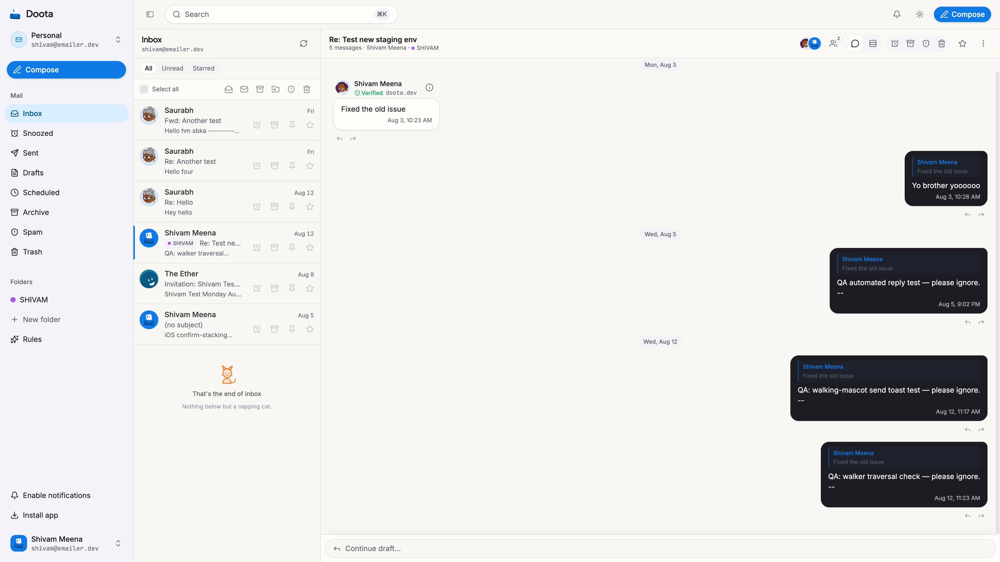
</picture>

### 13&Prime; laptop — 1440 × 900

The same three panes, tighter gutters.

<picture>
  <source media="(prefers-color-scheme: dark)" srcset="../apps/docs/public/media/thread-dark.png">
  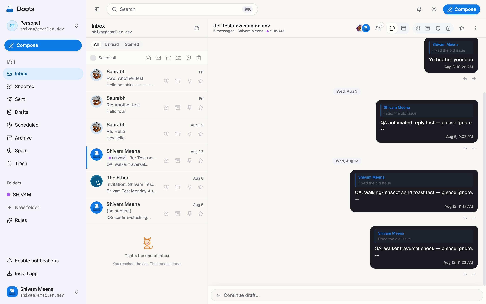
</picture>

### Tablet — 834 × 1112

Still above the shell switch, so the split view holds.

<picture>
  <source media="(prefers-color-scheme: dark)" srcset="../apps/docs/public/media/thread-tablet-dark.png">
  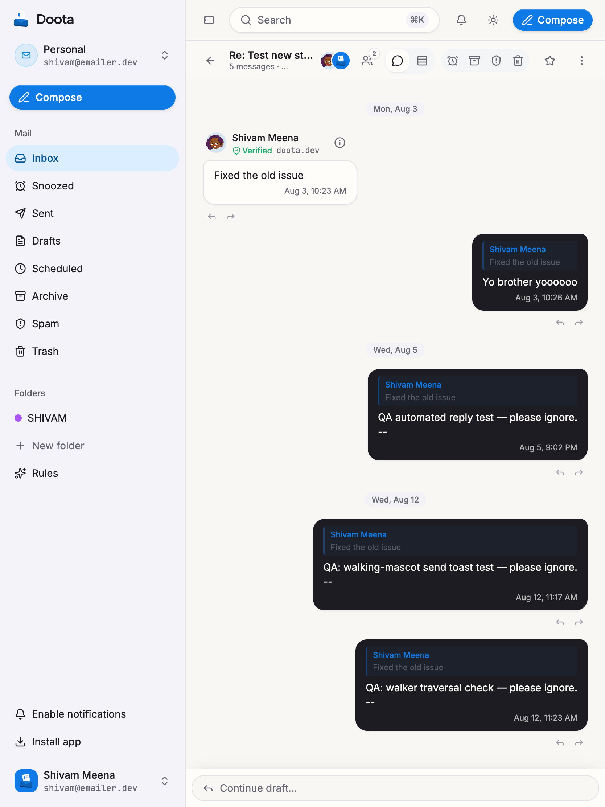
</picture>

### Phone — 390 × 844

Below the switch: the list and the conversation are two screens, one tap apart.

<table>
  <tr>
    <td width="50%" valign="top">
      <picture><source media="(prefers-color-scheme: dark)" srcset="../apps/docs/public/media/inbox-mobile-dark.png">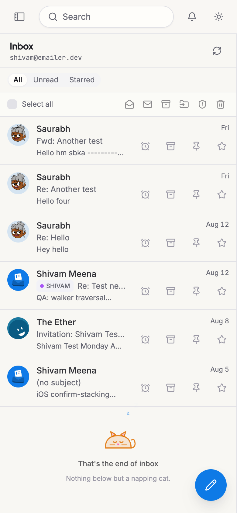</picture>
       <strong>Inbox</strong>
    </td>
    <td width="50%" valign="top">
      <picture><source media="(prefers-color-scheme: dark)" srcset="../apps/docs/public/media/thread-mobile-dark.png">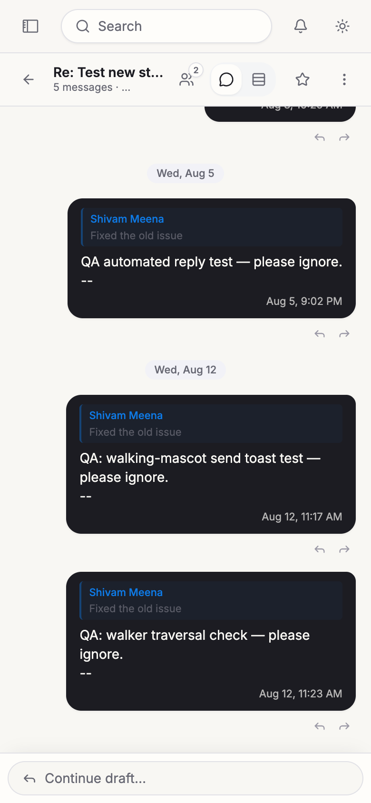</picture>
       <strong>Conversation</strong>
    </td>
  </tr>
</table>

---

## Writing

Three shapes, one composer. On the desktop it starts as a panel you can keep
open while you read; expand it and the attachments column comes out of hiding
alongside a full-height message. On a phone it is a real page in the document
flow — which is the whole trick: scrolling to a focused field is then the
browser's job, not ours, and the keyboard behaves.

### Expanded — the full-screen composer

Attachments get their own drop column, and the message body takes the rest.

<picture>
  <source media="(prefers-color-scheme: dark)" srcset="../apps/docs/public/media/composer-full-dark.png">
  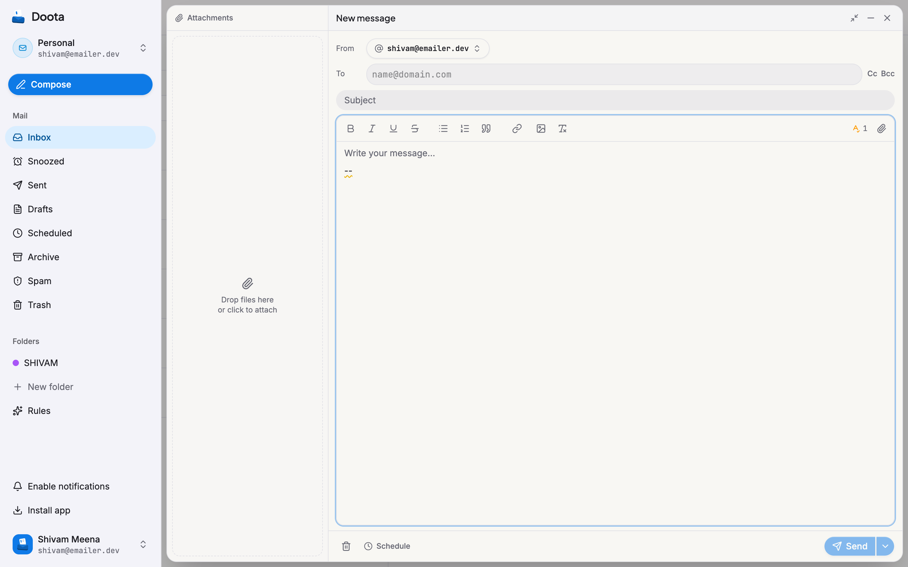
</picture>

### Panel and phone

<table>
  <tr>
    <td width="60%" valign="top">
      <picture><source media="(prefers-color-scheme: dark)" srcset="../apps/docs/public/media/composer-dark.png">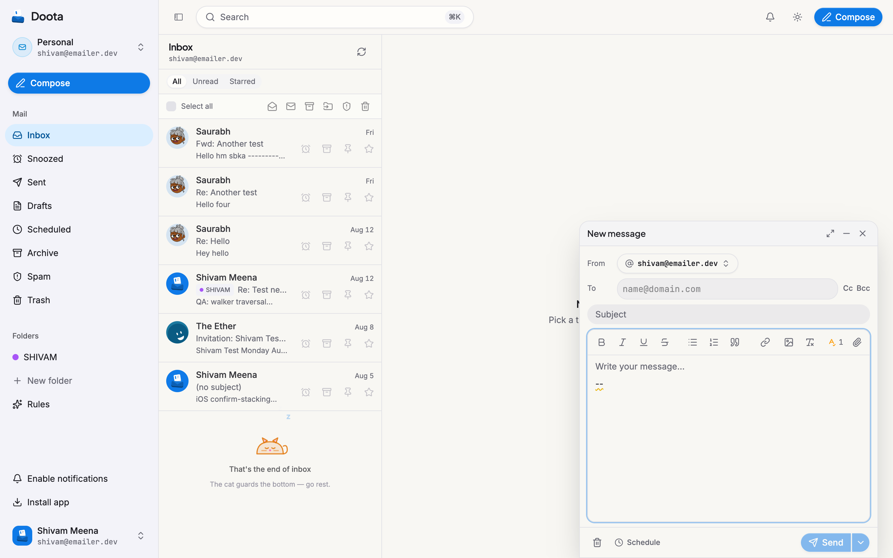</picture>
       <strong>Panel</strong> — rich text, scheduled send, undo, without leaving the thread.
    </td>
    <td width="40%" valign="top">
      <picture><source media="(prefers-color-scheme: dark)" srcset="../apps/docs/public/media/composer-mobile-dark.png">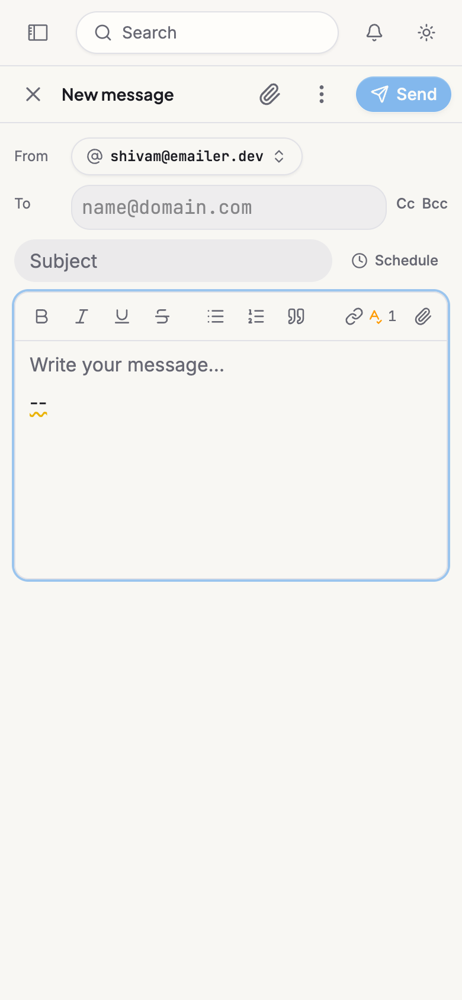</picture>
       <strong>On a phone</strong> — send lives in the header.
    </td>
  </tr>
</table>

---

## Aliases, admin, sign-in

<table>
  <tr>
    <td width="50%" valign="top">
      <picture><source media="(prefers-color-scheme: dark)" srcset="../apps/docs/public/media/aliases-dark.png">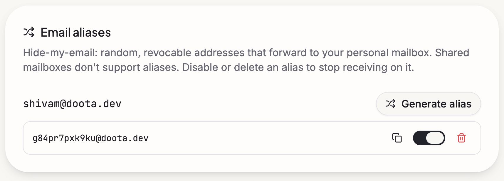</picture>
       <strong>Aliases</strong> — throwaway addresses on your own domain.
    </td>
    <td width="50%" valign="top">
      <picture><source media="(prefers-color-scheme: dark)" srcset="../apps/docs/public/media/admin-org-dashboard-dark.png">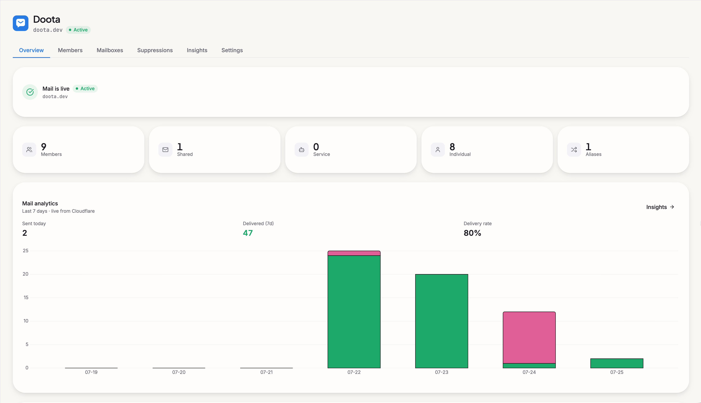</picture>
       <strong>Admin</strong> — org, members, domains in one place.
    </td>
  </tr>
  <tr>
    <td width="50%" valign="top">
      <picture><source media="(prefers-color-scheme: dark)" srcset="../apps/docs/public/media/sign-in-dark.png">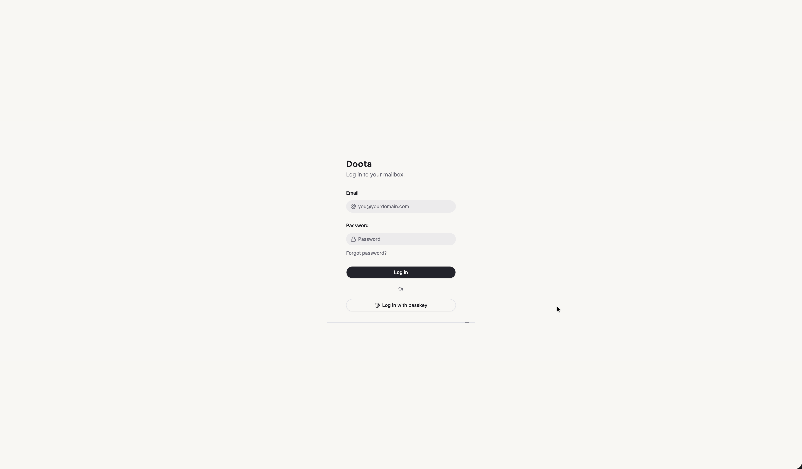</picture>
       <strong>Sign in</strong> — passwords or passkeys, out of the box.
    </td>
    <td width="50%" valign="top"></td>
  </tr>
</table>
